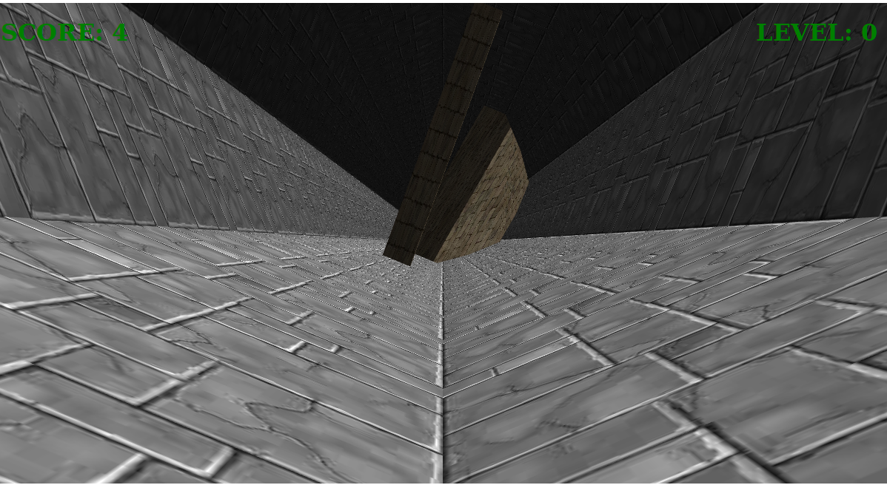
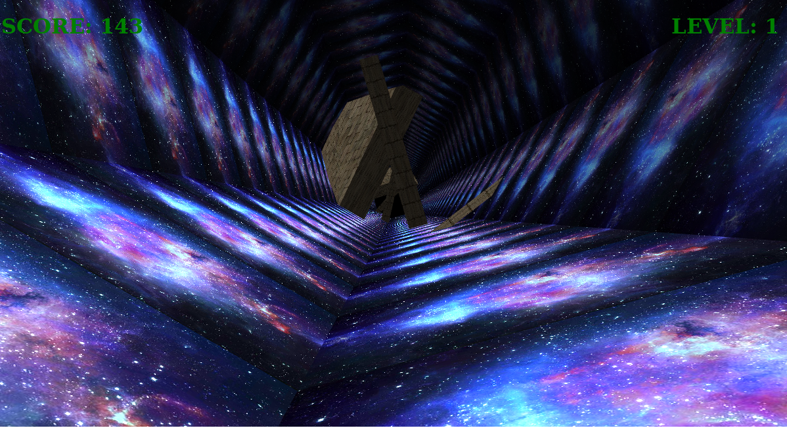

# Tunnel Rush

<br><br>

### Welcome to Tunnel Rush!  
You are trapped in an infinite octahedron shaped tunnel and you run on the bottom side.   
You need to travel as much distance as possible while dodging both stationary and moving obstacles. To dodge
obstacles, you can rotate the tunnel to change the bottom side or you can jump.  
After every few meters, you will enter a new level with a completely different world to play in. At each level, the game speed as well as the speed of rotation of the obstacles will be increased.  
Another obstacle in your way is flashbangs at random times which will blind you momentarily. You might hit an obstacle in that time if you are not fast enough!!

## How to Play
```
npm install
npm start
```


## Controls
- A/Left Arrow - Rotate Left
- D/Right Arrow - Rotate Right
- Space - Jump
- P - Pause
- G - Toggle between grayscale and RGB
